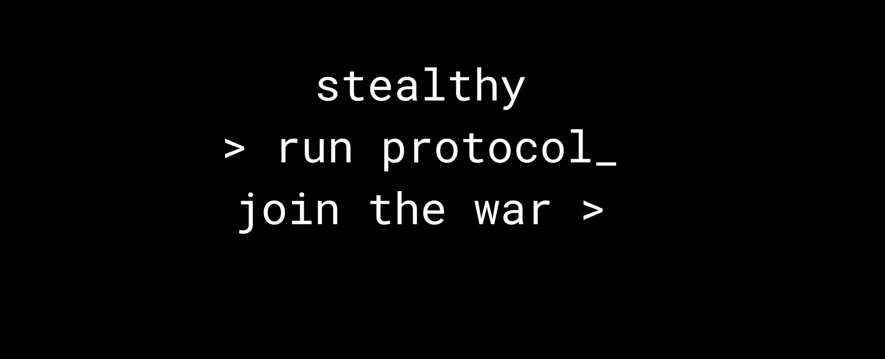

<div align="center">



<h1>STEALTHYLABS // PROFILE DOSSIER</h1>

<p>
  
  
  
  
</p>

> Building AI-native systems, MCP servers, agent workflows, and security-first tooling with a terminal-grade aesthetic.

<p>
  <a href="https://x.com/StealthyLabsHQ"></a>
  <a href="https://discord.com/users/1071461037741723648"></a>
  <a href="https://twitch.tv/stealthylabs"></a>
  <a href="https://tiktok.com/@stealthylabs"></a>
</p>


</div>

---

## Mission Brief

I build fast, opinionated systems at intersection of AI engineering, agent orchestration, and secure automation.

This profile is not meant to read like generic developer bio. It should feel like entry point into operating model:

- ship useful systems, not empty demos
- automate repeatable leverage
- secure early, not after launch
- make tooling feel sharp, deliberate, and alive

## Identity Matrix

| FIELD | VALUE | STATUS |
| :--- | :--- | :---: |
| CODENAME | `StealthyLabsHQ` | `ACTIVE` |
| UNIT | `StealthyLabs` | `ACTIVE` |
| OPERATING MODE | AI systems + infra + security | `LIVE` |
| SIGNAL | fast builds, deep iteration, zero fluff | `CONFIRMED` |

## Core Focus

| DOMAIN | CAPABILITY |
| :--- | :--- |
| AI Systems | building agentic products, workflows, and reasoning-assisted tooling |
| MCP Infrastructure | designing and deploying Model Context Protocol servers |
| Security | reducing attack surface and tightening system behavior by default |
| Automation | turning repetitive ops into reliable pipelines and operator tooling |
| Prototyping | high-speed implementation without losing structure or taste |

## Toolchain

<p>
  
  
  
  
  
  
  
</p>

## Verified Clearances

- [Google Cybersecurity](https://www.coursera.org/account/accomplishments/specialization/BT9A8BGITTC8)
- [Anthropic Claude API - Fundamentals](https://verify.skilljar.com/c/ztvbm76um6he)
- [Anthropic Claude API - Advanced](https://verify.skilljar.com/c/bvka7onrte8u)
- [Anthropic Claude API - Extended](https://verify.skilljar.com/c/28kv5x7izkrd)
- [DataCamp AI Engineering](https://www.datacamp.com/certificate/AIEDA0011599467581)
- [Google AI Professional Certificate](https://www.credly.com/badges/91985dd8-2609-4a3b-91b8-fa8a35efa7c0/linked_in_profile)

## Terminal Doctrine

```text
> build systems, not noise
> prototype with intent
> automate leverage
> secure before scale
```

<details>
<summary><b>Open extended dossier</b></summary>
<br>

| SECTION | NOTES |
| :--- | :--- |
| Architecture | MCP servers, internal tooling, workflow orchestration |
| Execution | fast iteration, direct implementation, small reviewable diffs |
| Security Posture | defensive by default, fewer moving parts, tighter control surfaces |
| Style | terminal aesthetic, dark signal palette, minimal fluff |

</details>

---

<div align="center">


<br>
<sub>DOSSIER REF: DOC-2026-SL84 // UNAUTHORIZED CLONING ADVISED AGAINST</sub>

</div>
